<div align="center">

<!-- ===== CAPSULE RENDER HEADER (ANIMATED WAVE) ===== -->


<!-- ===== ANIMATED TYPING SVG ===== -->
<a href="https://github.com/MinhNghia2610">
  
</a>

<br/><br/>

<!-- ===== PROFILE BADGES ===== -->

<a href="https://github.com/MinhNghia2610?tab=followers">
  
</a>


<br/>

<!-- ===== QUICK STATS BANNER ===== -->
<a href="https://github.com/MinhNghia2610?tab=repositories">
  
</a>
<a href="https://github.com/MinhNghia2610/MinhNghia2610/commits/main">
  
</a>
<a href="https://github.com/MinhNghia2610?tab=repositories&q=&type=source">
  
</a>
<a href="https://github.com/search?q=user%3AMinhNghia2610+is%3Aissue&type=issues">
  
</a>

</div>

<!-- ===== NEON DIVIDER ===== -->


<!-- ===== ABOUT ME ===== -->
<div align="center">
  <h2>
    
    About Me
  </h2>
</div>

```python
class NghiaLe:
    """AI Engineer building production-ready intelligent systems."""
    
    location    = "Ho Chi Minh City, Vietnam 🇻🇳"
    focus       = "AI Engineering • RAG • LLM Integration"
    methodology = "AI-Native Development — AI as engineering teammate"
    
    # Core competencies
    ai_stack    = [
        "RAG (FAISS + sentence-transformers + OpenAI)",
        "LLM Integration (OpenAI, Gemini, Llama 3)",
        "Prompt Engineering & Multi-AI Orchestration",
        "AI Voice Assistants (STT → NLU → TTS pipeline)",
        "AI-Assisted Development (Claude + Cursor workflow)"
    ]
    
    full_stack  = [
        "Python (Flask) • TypeScript • JavaScript",
        "Next.js 14 • NestJS • React • Node.js",
        "PostgreSQL • Redis • Prisma • SQLite",
        "Turborepo • pnpm • Docker"
    ]
    
    automation  = ["N8n Workflows", "Webhook Pipelines", "API Integration"]
    
    def philosophy(self):
        return "I treat AI as an engineering teammate — using it for design, " \
               "code generation, review, and debugging to ship faster " \
               "without compromising quality."

me = NghiaLe()
```

<!-- ===== NEON DIVIDER ===== -->


<!-- ===== TECH STACK ===== -->
<div align="center">
  <h2>🛠️ Tech Stack & Tools</h2>

  <h4>🧠 Artificial Intelligence</h4>
  
  
  
  
  

  <br/><br/>

  <h4>💻 Languages</h4>
  

  <br/><br/>

  <h4>⚙️ Frameworks & Libraries</h4>
  

  <br/><br/>

  <h4>🗄️ Databases & Infrastructure</h4>
  
  

  <br/><br/>

  <h4>⚡ Automation & Workflow</h4>
  
  
  
  
</div>

<!-- ===== NEON DIVIDER ===== -->


<!-- ===== FEATURED PROJECTS ===== -->
<div align="center">
  <h2>🚀 Featured Projects</h2>
</div>

<table align="center" width="100%">
  <tr>
    <td width="50%" valign="top">
      <h3 align="center">🧠 RAG Chatbot System</h3>
      <div align="center">
        <a href="https://github.com/MinhNghia2610/RAG">
          
        </a>
        <p>
          
          
          
          
          
        </p>
        <p align="left">Production-ready RAG system with FAISS vector search, sentence-transformers embeddings, and dual-backend LLM support (OpenAI + local fallback).</p>
      </div>
    </td>
    <td width="50%" valign="top">
      <h3 align="center">🎙️ OLLIE AI Voice Assistant</h3>
      <div align="center">
        <a href="https://github.com/MinhNghia2610/OLLIE--AI-Assisstant">
          
        </a>
        <p>
          
          
          
          
          
        </p>
        <p align="left">Vietnamese-first AI voice assistant with Google Gemini NLU, speech-to-text, TTS, music playback, live weather, and dual-mode UI (desktop + CLI).</p>
      </div>
    </td>
  </tr>
  <tr>
    <td width="50%" valign="top">
      <h3 align="center">👔 Vest E-Commerce Platform</h3>
      <div align="center">
        <a href="https://github.com/MinhNghia2610/Vest_Ecommerce">
          
        </a>
        <p>
          
          
          
          
          
        </p>
        <p align="left">Full-stack e-commerce platform with monorepo architecture (Turborepo, pnpm), dark luxury theme, JWT auth, payment integrations, and admin dashboard.</p>
      </div>
    </td>
    <td width="50%" valign="top">
      <h3 align="center">🤖 ChefBot AI Kitchen Assistant</h3>
      <div align="center">
        <a href="https://github.com/MinhNghia2610/ChefBot">
          
        </a>
        <p>
          
          
          
          
          
        </p>
        <p align="left">AI-powered cooking assistant using OpenAI API for meal planning, recipe generation, dietary tracking, and step-by-step cooking guidance.</p>
      </div>
    </td>
  </tr>
  <tr>
    <td width="50%" valign="top">
      <h3 align="center">🍽️ Restaurant POS + AI Chatbot</h3>
      <div align="center">
        <a href="https://github.com/MinhNghia2610/WEB_RESTAURANT_01">
          
        </a>
        <p>
          
          
          
          
          
        </p>
        <p align="left">Restaurant POS with integrated AI recommendation chatbot using Ollama + Llama 3, built with React, Vite, and Python backend.</p>
      </div>
    </td>
    <td width="50%" valign="top">
      <h3 align="center">🖼️ Computer Vision Projects</h3>
      <div align="center">
        <a href="https://github.com/MinhNghia2610/XLAVTGMT">
          
        </a>
        <p>
          
          
          
          
        </p>
        <p align="left">Image processing and computer vision projects exploring edge detection, filtering, object recognition, and OpenCV techniques.</p>
      </div>
    </td>
  </tr>
</table>

<!-- ===== NEON DIVIDER ===== -->


<!-- ===== AI-NATIVE DEVELOPMENT METHODOLOGY ===== -->
<div align="center">
  <h2>⚡ AI-Native Development Workflow</h2>
  <p><em>I don't just build AI — I build <strong>with</strong> AI. My methodology treats AI models as engineering teammates.</em></p>
</div>

| Phase | AI Tool | Role |
|-------|---------|------|
| 🎯 **Ideation & Architecture** | Claude Sonnet 4 | System design, feature planning, API architecture |
| 💻 **Implementation** | Cursor Agent | Code generation, API integration, UI building |
| 🔍 **Code Review** | Multi-model review | Syntax checking, logic validation, security auditing |
| 🐛 **Debugging** | AI-assisted | Stack trace analysis, bug fixing, optimization |
| 🔄 **Automation** | N8n + AI APIs | Workflow automation, data pipelines, webhook orchestration |

<!-- ===== WAVE DIVIDER ===== -->


<!-- ===== GITHUB STATS ===== -->
<div align="center">
  <h2>📊 GitHub Analytics</h2>

  <table>
    <tr>
      <td>
        
      </td>
      <td>
        
      </td>
    </tr>
  </table>

  <br/>

  

  <br/><br/>

  
</div>

<!-- ===== WAVE DIVIDER ===== -->


<!-- ===== PROFILE SUMMARY CARDS ===== -->
<div align="center">
  <h2>📈 Profile Summary</h2>
  <p><em>Comprehensive overview of commit patterns, repository activity, and contribution timeline</em></p>
  <br/>

  <picture>
    <source media="(prefers-color-scheme: dark)" srcset="https://github-profile-summary-cards.vercel.app/api/cards/profile-details?username=MinhNghia2610&theme=tokyonight" />
    <source media="(prefers-color-scheme: light)" srcset="https://github-profile-summary-cards.vercel.app/api/cards/profile-details?username=MinhNghia2610&theme=github" />
    
  </picture>

  <br/><br/>

  <table>
    <tr>
      <td>
        <picture>
          <source media="(prefers-color-scheme: dark)" srcset="https://github-profile-summary-cards.vercel.app/api/cards/repos-per-language?username=MinhNghia2610&theme=tokyonight" />
          <source media="(prefers-color-scheme: light)" srcset="https://github-profile-summary-cards.vercel.app/api/cards/repos-per-language?username=MinhNghia2610&theme=github" />
          
        </picture>
      </td>
      <td>
        <picture>
          <source media="(prefers-color-scheme: dark)" srcset="https://github-profile-summary-cards.vercel.app/api/cards/most-commit-language?username=MinhNghia2610&theme=tokyonight" />
          <source media="(prefers-color-scheme: light)" srcset="https://github-profile-summary-cards.vercel.app/api/cards/most-commit-language?username=MinhNghia2610&theme=github" />
          
        </picture>
      </td>
    </tr>
    <tr>
      <td>
        <picture>
          <source media="(prefers-color-scheme: dark)" srcset="https://github-profile-summary-cards.vercel.app/api/cards/stats?username=MinhNghia2610&theme=tokyonight" />
          <source media="(prefers-color-scheme: light)" srcset="https://github-profile-summary-cards.vercel.app/api/cards/stats?username=MinhNghia2610&theme=github" />
          
        </picture>
      </td>
      <td>
        <picture>
          <source media="(prefers-color-scheme: dark)" srcset="https://github-profile-summary-cards.vercel.app/api/cards/productive-time?username=MinhNghia2610&theme=tokyonight" />
          <source media="(prefers-color-scheme: light)" srcset="https://github-profile-summary-cards.vercel.app/api/cards/productive-time?username=MinhNghia2610&theme=github" />
          
        </picture>
      </td>
    </tr>
  </table>
</div>

<!-- ===== WAVE DIVIDER ===== -->


<!-- ===== CONTRIBUTION ACTIVITY ===== -->
<div align="center">
  <h2>📈 Contribution Activity</h2>
  
</div>

<!-- ===== WAVE DIVIDER ===== -->


<!-- ===== RECENT GITHUB ACTIVITY ===== -->
<div align="center">
  <h2>⚡ Recent GitHub Activity</h2>
  <p><em>My latest contributions across repositories — updated every 30 minutes via GitHub Actions</em></p>
</div>

<!--START_SECTION:activity-->
<!--END_SECTION:activity-->

<!-- ===== WAVE DIVIDER ===== -->


<!-- ===== METRICS DASHBOARD ===== -->
<div align="center">
  <h2>📊 Comprehensive Metrics</h2>
  <p><em>Deep analytics powered by <a href="https://github.com/lowlighter/metrics">lowlighter/metrics</a> — updated daily via GitHub Actions</em></p>
  <br/>
  
  <br/>
  <sup>⚡ <em>Enable GitHub Actions and add a <code>METRICS_TOKEN</code> secret (with <code>repo</code> scope) for auto-generation</em></sup>
</div>

<!-- ===== WAVE DIVIDER ===== -->


<!-- ===== CONTRIBUTION GALLERY ===== -->
<div align="center">
  <h2>🎨 Contribution Gallery</h2>
  <p><em>Visual representations of my coding activity — automatically updated via GitHub Actions</em></p>
  <br/>

  <table>
    <tr>
      <td width="50%" align="center">
        <h3>🧊 3D Contribution Profile</h3>
        
        <br/>
        <sup>📅 <em>Updated daily — shows contribution patterns over time</em></sup>
      </td>
      <td width="50%" align="center">
        <h3>🐍 Contribution Snake</h3>
        
        <br/>
        <sup>🐍 <em>Watch the snake eat your contribution graph!</em></sup>
      </td>
    </tr>
  </table>

  <br/>
  <sup>⚡ <em>Enable GitHub Actions in your repo settings to auto-generate these visualizations</em></sup>
</div>

<!-- ===== CODE DIVIDER ===== -->


<!-- ===== DEV QUOTE ===== -->
<div align="center">
  <h2>💭 Dev Quote</h2>
  
</div>

<!-- ===== CODE DIVIDER ===== -->


<!-- ===== SPOTIFY NOW PLAYING ===== -->
<div align="center">
  <h2>🎧 Coding Vibes</h2>
  <p><em>What I'm listening to while building the future with AI</em></p>
  <br/>

  <!--
    🎵 To enable Spotify Now Playing:
    1. Visit https://spotify-github-profile.vercel.app/api/login
    2. Authorize with your Spotify account
    3. Replace YOUR_SPOTIFY_ID below with your Spotify User ID
  -->
  <a href="https://open.spotify.com/user/YOUR_SPOTIFY_ID">
    
  </a>
  <br/>
  <sup>🎵 <a href="https://spotify-github-profile.vercel.app/api/login">Authorize Spotify</a> to auto-update your now playing status</sup>
</div>

<!-- ===== CODE DIVIDER ===== -->


<!-- ===== LET'S CONNECT & SUPPORT ===== -->
<div align="center">
  <h2>🌐 Let's Connect & Support</h2>

  <h3>🔗 Connect With Me</h3>
  <a href="https://github.com/MinhNghia2610">
    
  </a>
  <a href="https://www.linkedin.com/in/nghia-le-045377245/">
    
  </a>
  <a href="mailto:devminhnghia2610@gmail.com">
    
  </a>

  <br/><br/>

  
  <br/>
  <em><b>Open to remote opportunities in AI Engineering, Prompt Engineering, and AI Evaluation.</b> Let's build something intelligent! 🚀</em>

  <br/><br/>

  <h3>☕ Support My Work</h3>
  <p><em>If you find my projects valuable, consider supporting my open-source work!</em></p>

  <br/>

  <!-- Replace YOUR_COFFEE_USERNAME with your Buy Me a Coffee username -->
  <a href="https://www.buymeacoffee.com/YOUR_COFFEE_USERNAME" target="_blank">
    
  </a>
  &nbsp;
  <a href="https://ko-fi.com/YOUR_KOFI_USERNAME" target="_blank">
    
  </a>
  &nbsp;
  <a href="https://github.com/sponsors/MinhNghia2610" target="_blank">
    
  </a>

  <br/><br/>
  
  <br/>
  <em>Every contribution helps me build more AI-powered tools and open-source projects! 🚀</em>
</div>

<!-- ===== FOOTER WAVE ===== -->


<div align="center">
  <sub>⚡ Built with AI-native workflows by <a href="https://github.com/MinhNghia2610">MinhNghia2610</a></sub>
</div>
